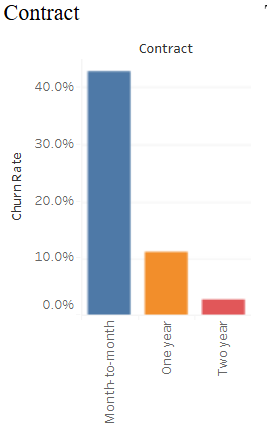
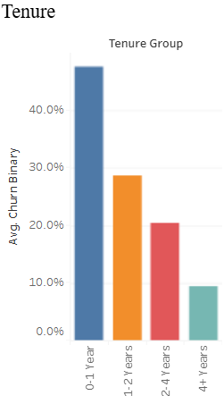
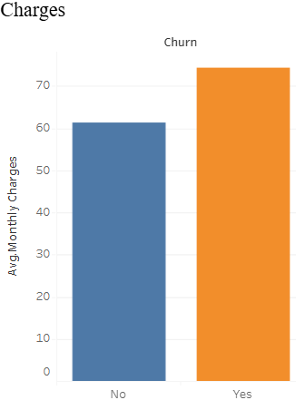

# Customer-Churn-Analysis
Predicting customer churn using Python, Pandas, SQL, and Tableau

## Key Findings

Customers churn month to month at over 40% while 2 year contract customers churn at a mere 2.8%. This is the biggest churn driver in the dataset. There's no reason for customers without a long-term commitment to stick around. The company should try to encourage month-to-month customers to sign up for longer term contracts, perhaps with incentives or discounts.

47.4% of customers churn in their first year, then drop sharply to 9.5% for customers who’ve been around 4+ years. This shows you the first year is the most critical window — if the business can retain customers beyond the 12-month mark, they become significantly more loyal. Onboarding experience and early engagement are the key levers here.

 

Fiber optic customers churn at ~42%, more than double the rate of DSL customers at 19%. This is concerning, because fiber optic is the top-of-the-line, more expensive service. This may indicate service quality issues, unmet expectations or tough competition in this segment. For those who do not have internet service, the churn rate is only 7.4%. This tells us that the dissatisfaction is really with the internet product.

Customers who churned were paying an average of ~$74/month than ~$61 for those who stayed. That’s a $13 difference, meaning that churned customers are on more expensive plans — probably fiber optic or premium services — but don’t feel they’re getting enough value for the money. “The business has to figure out if the high-paying customers are getting what they’re paying for.”

## Main Takeaway

The data tells a clear and consistent story: customers most likely to churn are new, on flexible contracts and paying a premium for fibre optic service. Nearly half of all customers leave within the first year, and month-to-month subscribers leave at a rate of over 40% – more than 14x the churn of customers on 2 year contracts. What’s really scary is churned customers are actually paying more per month ($74 vs $61) which means the company is losing its highest paying customers the fastest. Fiber optic subscribers, the premium tier of the business, churn at 42%, more than double the rate of DSL customers. This suggests the problem isn’t price sensitivity, it’s perceived value. Customers are willing to pay more, but something in the experience – whether it’s the quality of service, unmet expectations or stiffer competition – is driving them out the door before they even make it through their first year. The best way to reduce churn is to focus on the first 12 months. Improve onboarding, push for longer term contracts and get to the root of what is causing dissatisfaction in the fiberoptic segment.

## Tools Used

Python: Raw data was loaded from Kaggle, which contains 7043 records of telco customers. Used Pandas to clean and transform the data including fixing blank TotalCharges values, converting SeniorCitizen to readable labels and engineering new features including Tenure Group, Charge Tier and Number of Services.

Pandas: Data cleaning, transformation, and feature engineering all. Standardized column names, handled missing values, created customer segmentation fields, and exported the final cleaned dataset to SQL and Tableau.

SQL (SQLite via DBeaver): I imported the cleaned dataset into a relational database and wrote analytical queries to calculate churn rates by contract type, tenure group, internet service, and average monthly charges for churned vs retained customers.

Tableau Public: Created an individual customer churn analysis dashboard by merging four interactive visualizations that investigated key churn drivers by contract type, tenure, internet service, and monthly charges.

GitHub: Version control and public hosting of the project repository including Python pipeline script, SQL query files, cleaned output data, and README documentation for portfolio presentation.

## Dashboard

[Telco Customer Churn Analysis](https://public.tableau.com/app/profile/raianul.quader/viz/TelcoCustomerChurnAnalysis_17777878179300/Dashboard1)

## Data Source

Data sourced from the [Telco Customer Churn dataset on Kaggle](https://www.kaggle.com/code/emineyetm/telco-customer-churn/notebook), uploaded by Emine Bozkus, PhD, originally provided by IBM. The dataset contains 7,043 customer records with demographic, account, and service information used to analyze and predict customer churn.